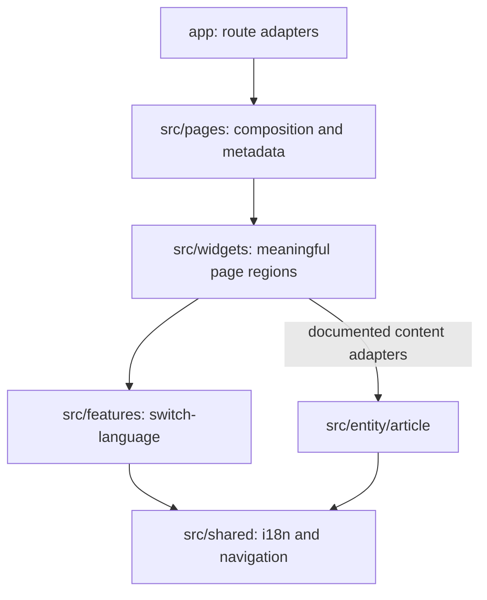

# Architecture

## Adopted contract

The application follows the owner's Logistics architecture: root `app/`, FSD `src/pages`, singular `src/entity`, root composition components and environment-specific public APIs. These deliberately override the generic FSD skill's `_pages`/`entities` recommendations. Root `pages/README.md` prevents framework discovery of the FSD pages tree.

Pages import widgets/shared only. Widgets import features/shared, except the explicit article adapters below. Features import entity/shared. Entity imports shared only. Same-layer slices do not import one another. Cross-slice imports use public APIs. Relative imports remain within a slice.

## Ownership

- `pages/home`: editorial home copy and section composition.
- `pages/article`: route composition and metadata facade.
- `widgets/site-shell`: header, footer and document region.
- `widgets/home-intro`, `selected-work`, `personal-projects`, `writing-summary`, `about-profile`: independently meaningful home sections.
- `widgets/article-reader`: document rendering and build-time data prefetch.
- `features/switch-language`: retain the document path while selecting EN/RU.
- `entity/article`: localized article records, featured selection, typed slugs and Markdown IO.
- `shared/lib/i18n`: locale validation, supported locales and interface dictionaries.
- `shared/ui/site-link`: UI-kit link primitive with base-path handling.
- `shared/components`: reserved for reusable compound UI; currently contains only its ownership README.
- `shared/styles`: accepted tokens and shared typography roles.

### Explicit widget/entity adapters

`selected-work` maps the article catalog to selected work links. `writing-summary` maps writing metadata to its teaser. `article-reader` reads Markdown server-side and maps metadata to the document header. These are intentional adapters, not permission for arbitrary direct entity imports from widgets.

## Runtime boundary

`entity/article/index.ts` is client-safe metadata/types. `index.server.ts` exposes filesystem access and imports `server-only`. The article reader and article page expose server-only entrypoints. Markdown is read during static generation; the export requires no runtime backend. No client component imports filesystem code.

## Checks

Steiger covers generic FSD imports and public APIs. Its layer-name, insignificant-slice, segment naming and root-composition exceptions match Logistics. The copied ESLint taxonomy rule enforces role-named files, barrel exports and server-safe entrypoints. Project import rules additionally enforce the stricter layer matrix, valid source layers and shared segments; see `scripts/eslint/project-boundaries.mjs`.

These rules check mechanics. Semantic ownership still needs code review. A style refactor or new infrastructure is not justified merely to satisfy a generic skill.
